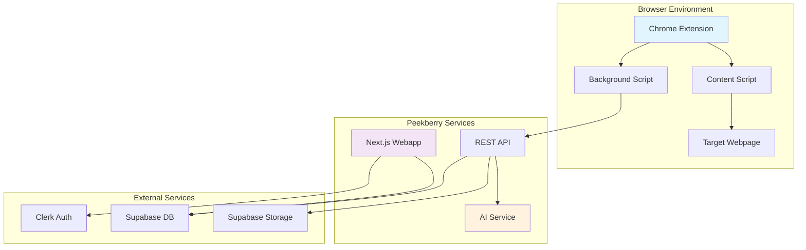

# Design Document

## Overview

Peekberry MVP consists of two main components: a Chrome extension for in-browser editing and a Next.js webapp for user management and dashboard functionality. The architecture emphasizes real-time DOM manipulation, secure authentication flow, and seamless data synchronization between the extension and webapp.

The system uses a microservices approach where the Chrome extension handles UI interaction and DOM manipulation, while the webapp manages user accounts, data persistence, and provides a dashboard interface. An AI service processes natural language commands and returns DOM/CSS mutations.

## Architecture

### High-Level Architecture



### Component Interaction Flow

1. **Authentication Flow**: User authenticates via webapp → Clerk issues token → Token synced to extension storage
2. **Edit Flow**: User selects element → Content script captures context → Background script calls webapp API → API calls AI service → Mutations returned and applied to DOM
3. **Screenshot Flow**: User captures screenshot → Image processed and uploaded to Supabase → Dashboard updated with new entry

## Components and Interfaces

### Chrome Extension Components

#### Manifest Configuration

```json
{
  "manifest_version": 3,
  "name": "Peekberry",
  "version": "1.0.0",
  "permissions": ["activeTab", "storage", "scripting"],
  "host_permissions": ["<all_urls>"],
  "background": {
    "service_worker": "background.js"
  },
  "content_scripts": [
    {
      "matches": ["<all_urls>"],
      "js": ["content.js"],
      "css": ["content.css"]
    }
  ]
}
```

#### Content Script Interface

```typescript
interface ContentScript {
  // DOM Interaction
  initializeElementSelection(): void;
  highlightElement(element: HTMLElement): void;
  selectElement(element: HTMLElement): ElementContext;
  applyMutation(mutation: DOMMutation): void;

  // UI Management
  createPeekberryBubble(): void;
  showChatPanel(): void;
  hideChatPanel(): void;

  // Screenshot
  captureScreenshot(): Promise<Blob>;

  // Session Management
  getEditHistory(): EditAction[];
  undoLastEdit(): void;
  redoEdit(): void;
}

interface ElementContext {
  selector: string;
  tagName: string;
  id?: string;
  className?: string;
  textContent?: string;
  computedStyles: CSSStyleDeclaration;
  boundingRect: DOMRect;
}
```

#### Background Script Interface

```typescript
interface BackgroundScript {
  // API Communication
  processEditCommand(
    command: string,
    context: ElementContext
  ): Promise<DOMMutation>;
  syncAuthToken(token: string): Promise<void>;
  uploadScreenshot(
    imageBlob: Blob,
    metadata: ScreenshotMetadata
  ): Promise<Screenshot>;

  // Storage Management
  getAuthToken(): Promise<string | null>;
  storeAuthToken(token: string): Promise<void>;
  clearAuthToken(): Promise<void>;
}

interface DOMMutation {
  type: "style" | "attribute" | "content";
  selector: string;
  property: string;
  value: string;
  previousValue?: string;
}
```

### Next.js Webapp Components

#### API Layer Structure

```typescript
// src/api/auth.ts
export interface AuthAPI {
  getCurrentUser(): Promise<User>;
  signOut(): Promise<void>;
  getAuthToken(): Promise<string>;
}

// src/api/screenshots.ts
export interface ScreenshotAPI {
  uploadScreenshot(
    file: File,
    metadata: ScreenshotMetadata
  ): Promise<Screenshot>;
  getScreenshots(userId: string): Promise<Screenshot[]>;
  deleteScreenshot(id: string): Promise<void>;
}

// src/api/analytics.ts
export interface AnalyticsAPI {
  getUserStats(userId: string): Promise<UserStats>;
  incrementEditCount(userId: string): Promise<void>;
  incrementScreenshotCount(userId: string): Promise<void>;
}

// src/api/ai.ts
export interface AIAPI {
  processEditCommand(
    command: string,
    context: ElementContext
  ): Promise<DOMMutation>;
}
```

#### Component Architecture

```typescript
// Dashboard Components
interface DashboardProps {
  user: User;
  stats: UserStats;
  screenshots: Screenshot[];
}

// Screenshot Gallery
interface ScreenshotGalleryProps {
  screenshots: Screenshot[];
  onDelete: (id: string) => void;
  onDownload: (screenshot: Screenshot) => void;
}

// Stats Cards
interface StatsCardProps {
  title: string;
  value: number;
  icon: ReactNode;
  trend?: "up" | "down" | "neutral";
}
```

## Data Models

### Core Data Types

```typescript
interface User {
  // User data comes from Clerk - we don't store this in Supabase
  id: string; // Clerk user ID
  email: string;
  createdAt: Date;
  lastLoginAt: Date;
  // Additional user properties managed by Clerk
}

interface Screenshot {
  id: string;
  clerkUserId: string; // References Clerk user ID
  filename: string;
  url: string;
  thumbnailUrl: string;
  metadata: ScreenshotMetadata;
  createdAt: Date;
  size: number;
}

interface ScreenshotMetadata {
  pageUrl: string;
  pageTitle: string;
  editCount: number;
  dimensions: {
    width: number;
    height: number;
  };
}

interface UserStats {
  clerkUserId: string; // References Clerk user ID
  editsThisMonth: number;
  screenshotsThisMonth: number;
  totalEdits: number;
  totalScreenshots: number;
  lastActivity: Date;
}

interface EditAction {
  id: string;
  type: "style" | "attribute" | "content";
  element: ElementContext;
  mutation: DOMMutation;
  timestamp: Date;
  undoable: boolean;
}
```

### Database Schema (Supabase)

```sql
-- Note: User identity is managed by Clerk, we only store Clerk user IDs

-- Screenshots table
CREATE TABLE screenshots (
  id UUID PRIMARY KEY DEFAULT gen_random_uuid(),
  clerk_user_id VARCHAR NOT NULL, -- References Clerk user ID
  filename VARCHAR NOT NULL,
  url VARCHAR NOT NULL,
  thumbnail_url VARCHAR,
  page_url VARCHAR NOT NULL,
  page_title VARCHAR,
  edit_count INTEGER DEFAULT 0,
  width INTEGER,
  height INTEGER,
  file_size INTEGER,
  created_at TIMESTAMP DEFAULT NOW()
);

-- User statistics table
CREATE TABLE user_stats (
  clerk_user_id VARCHAR PRIMARY KEY, -- References Clerk user ID
  edits_this_month INTEGER DEFAULT 0,
  screenshots_this_month INTEGER DEFAULT 0,
  total_edits INTEGER DEFAULT 0,
  total_screenshots INTEGER DEFAULT 0,
  last_activity TIMESTAMP DEFAULT NOW(),
  updated_at TIMESTAMP DEFAULT NOW()
);

-- Indexes for performance
CREATE INDEX idx_screenshots_clerk_user_id ON screenshots(clerk_user_id);
CREATE INDEX idx_screenshots_created_at ON screenshots(created_at DESC);
CREATE INDEX idx_user_stats_last_activity ON user_stats(last_activity DESC);
```

## Error Handling

### Chrome Extension Error Handling

```typescript
class ExtensionErrorHandler {
  static handleDOMError(error: Error, context: string): void {
    console.error(`DOM Error in ${context}:`, error);
    // Graceful degradation - don't break host website
    this.showUserNotification("Unable to apply edit. Please try again.");
  }

  static handleAPIError(error: Error, operation: string): void {
    console.error(`API Error during ${operation}:`, error);
    // Retry logic for network errors
    if (error.name === "NetworkError") {
      this.retryOperation(operation);
    } else {
      this.showUserNotification(
        "Connection error. Please check your internet."
      );
    }
  }

  static handleAuthError(): void {
    // Clear invalid tokens and prompt re-authentication
    chrome.storage.local.clear();
    this.showUserNotification(
      "Please re-authenticate in the Peekberry webapp."
    );
  }
}
```

### Webapp Error Handling

```typescript
// Global error boundary
class GlobalErrorBoundary extends React.Component {
  componentDidCatch(error: Error, errorInfo: ErrorInfo) {
    // Log to monitoring service
    console.error("Global error:", error, errorInfo);

    // Show user-friendly error message
    this.setState({ hasError: true });
  }
}

// API error handling with React Query
const queryClient = new QueryClient({
  defaultOptions: {
    queries: {
      retry: (failureCount, error) => {
        if (error.status === 401) return false; // Don't retry auth errors
        return failureCount < 3;
      },
      onError: (error) => {
        if (error.status === 401) {
          // Redirect to login
          window.location.href = "/sign-in";
        }
      },
    },
  },
});
```

This design provides a comprehensive architecture for the Peekberry MVP, covering all the requirements with detailed technical specifications and error handling strategies. The modular design ensures maintainability and scalability while keeping the MVP scope focused and achievable.
